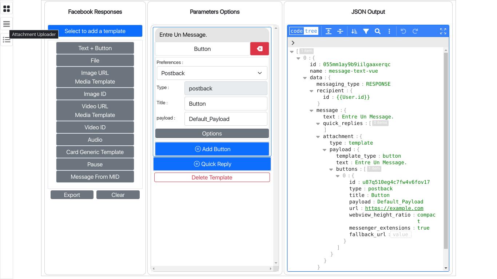

# Facebook Send API Helper

This program, written Vuejs is a tool that helps creating and managing Facebook Send API message and templates in JSON Format. Many Bot builder has their one, so this project has the goal to create a simple tool that any one can use and tweak as they want.

The JSON editor used here is from [svelte-jsoneditor](https://github.com/josdejong/svelte-jsoneditor), manualy connected to the app using simple Javascript.

## Structure

Three components are already implemented within this app, the main view, which has a set of buttons, a renderer, and a JSON editor, where you can manage the message and the template, the second view is the attachment uploader helpers that heavily uses axios, and the last is an another JSON editor that display the latest exported result.

## Screenshoot



## Project Setup
The project is a Vuejs app created using Vite.

```sh
npm install
```

### Compile and Hot-Reload for Development

```sh
npm run dev
```

### Compile and Minify for Production

```sh
npm run build
```

### TODO
- Attachment Uploader Helper
- History Management - Import/Export
- Export to File
- JSON validator
- Import from valid JSON
