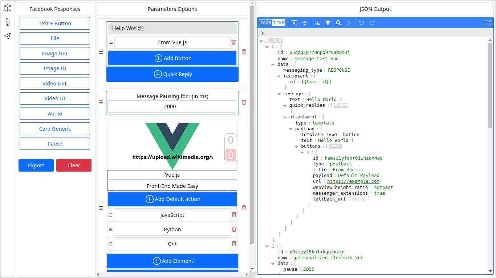
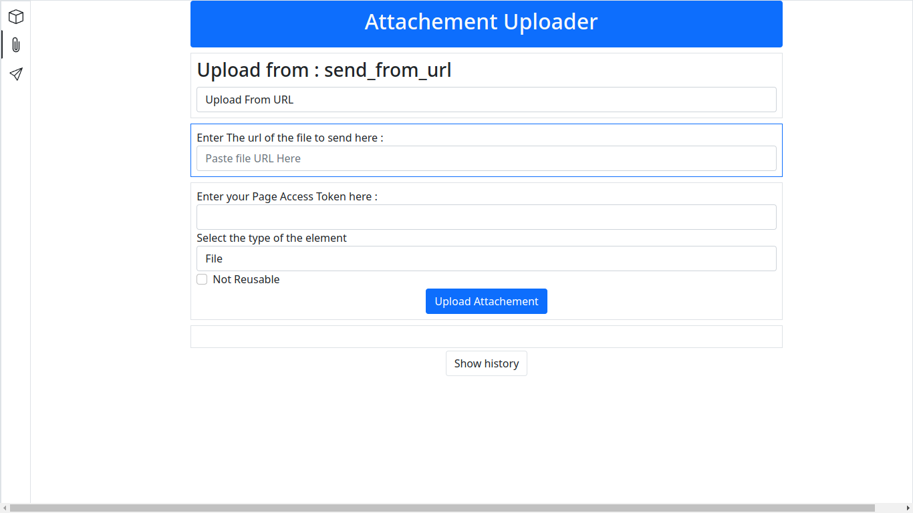
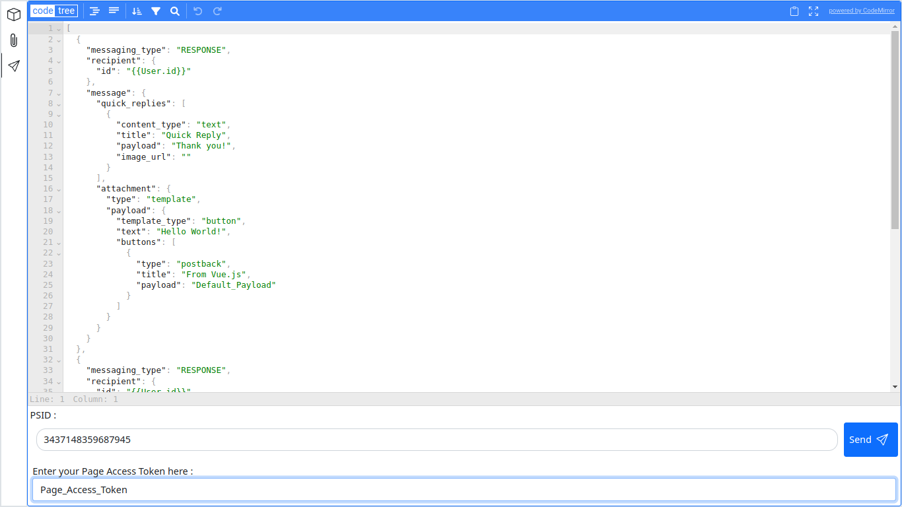
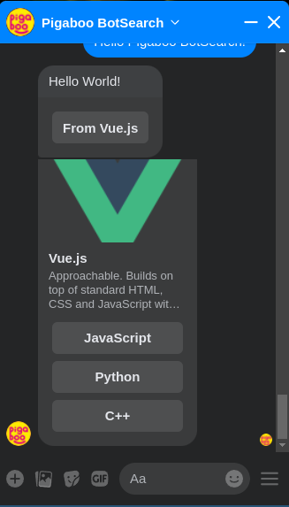

# Facebook Send API Helper

[](https://opensource.org/licenses/MIT)

This program, written with **Vue3** is a tool that helps creating and managing **Facebook Send API message and templates** in JSON Format.

This tool can help testing how the generated JSON will be displayed on Facebook Messenger by sending it to a person with a Facebook [Page Access Token](https://developers.facebook.com/docs/facebook-login/guides/access-tokens) and a [PSID](https://developers.facebook.com/docs/pages/support/psid-api/), every Bot developer should be familiar with that.

The JSON editor used here is from [svelte-jsoneditor](https://github.com/josdejong/svelte-jsoneditor), manualy connected to the app using simple Javascript. And the `Drag and Drop` functionalities uses [vue3-smooth-dnd](https://github.com/gilnd/vue3-smooth-dnd), a Vue3 wrapper of the package with the same name [vue-smooth-dnd](https://github.com/kutlugsahin/vue-smooth-dnd).

## Main Interface



The main interface is the place where the creation of the message or the template that we want to send takes place. The task is reduced to choosing and creating the message that we want with a program that displays a very flexible form that assists the user in the dynamic generation of a JSON payload, all of this following the structure required by Facebook in the official documentation of its [API](https://developers.facebook.com/docs/messenger-platform/send-messages/templates/).

### Features

1. _Reordering_ the form elements can be done by **Dragging and Dropping** them.
2. Elements can be added from the **Facebook Responses** buttons and deleted with the delete icons.
3. It is possible to modify data in the form or by changing a value of a key in the generated JSON.

Data cannot be imported from JSON, it is still an work in progress, so the priority for now is the usage of the form.

> Modifying JSON directly can be done in the `Message Sender` menu. The payload can be modified that way, before copying, sending and testing it.

### Lists of implemented Templates

- `Text + Button` :left_speech_bubble: : This template is the combination of two, when clicked, a [Text Message](https://developers.facebook.com/docs/messenger-platform/send-messages#sending_text) form is first displayed into the editor, so we can enter a simple text. But if the user wants a [Button](https://developers.facebook.com/docs/messenger-platform/send-messages/template/button/) instead, he can just add one, or two or three, and the payload will adapt himself accordingly.

> There are many types of Buttons as described in the documentation. Every Options has been implemented withing the button components hanlding all possibles use cases.

- `Card Generic` : Also known as a [Generic Template](https://developers.facebook.com/docs/messenger-platform/send-messages/template/generic), this element can handle 10 childs, each with an image link, a title, a subtitle, a default action, and three buttons.

- `Image URL, Video URL` : [Media Template](https://developers.facebook.com/docs/messenger-platform/send-messages/template/media) These elements are images or video that can be fetched from **Facebook URL** or an **Attachment ID**, in witch we can add one button.

- `Image ID, Video ID, Audio, File` : These four elements are very similar, [Sending Attachment](https://developers.facebook.com/docs/messenger-platform/send-messages#sending_attachments) don't need much information. We just need their **Type** and their **Attachment ID** that we can get _easily_ with the `Attachment Uploader` as described after this section, instead of creating an unique element for all of them, this approach helps to give more weight to the UI.

- `Pause` : This element is not a part of Messenger API, it is a custom component that serve as a delay while sending more than one message, it can for example helps visualize Quick Replies that is overiden by the next message after the one that bears it.

> Each element can have at most 12 [Quick Replies](https://developers.facebook.com/docs/messenger-platform/send-messages/quick-replies), these Quick Replies can also be **dragged and drop** if the users need to sort them, and like the buttons all uses case are handled in terms of options.

### Buttons Export and Clear

- The `Export` button : Will parse the raw JSON data with all the unecessary data that we can visualize in the JSON output of the Main Interface and copy the result to the clipboard, and display the data to the `Message Sender` tab where the payload can be edited and sended.

- The `Clear` button : It has only one function, clear the editor and the JSON Output.

## Attachment Uploader



This section will describe the usage of the **Messenger Attachment Uploader** tab. According to the official Facebook API [Saving Assets](https://developers.facebook.com/docs/messenger-platform/send-messages/saving-assets), it is possible to send local file or remote file as an attachment in Messenger, while the file can directly be sended, with this way, it will be first uploaded and after reused if the _Not Resuable_ key is not manualy set.

The program will give the user all the choices available :

- The file can be uploaded _localy_ or _remotely_,

  - If localy, the user can choose a path or simply drop it in a dropable field.
  - If remotely, the user will have to provide a direct download link where Messenger API can fetch it.

- There are four different types of files that we can specify, and it match the four elements that we cited in the previous paragraph : `File`, `Image`, `Video`, `Audio`.
- A Flag can be specified, allowing the payload to be reusable or for just only one time usage.

> To successfully upload the attachment and receive an `Attachment ID` in response, a **Page Access Token** is mandatory, the same Access Token that we will need to send the file.

The history of all the uploads will be stored in the state, so the user must be aware that it will be lost if the page is refreshed.

## Message Sender



As it was stated in the previous paragraph, once the `Export` button is clicked, the parsed JSON will be copied into the clipboard and also transfered to the last menu of the program.

### Feature

The main feature of this part of the program is that we can enter the _User PSID_ to send the message or the template, with the appropriate access token, so we can test how the generated message is displayed on Messenger.

## :arrow_forward: Example of Final Results



:arrow_right: This image show how the result of the message that we generated in the image of the Main Interface, sent with the `Message Sender` are displayed in a real Facebook Chat thread.

## Project Setup

The project is a Vuejs app created using Vite.

```sh
npm install
```

### Compile and Hot-Reload for Development

```sh
npm run dev
```

### Compile and Minify for Production

```sh
npm run build
```

### TODO

- Attachment Uploader Helper :heavy_check_mark:
- Undo / Redo
- History Management
- Import/Export
- Export to File
- JSON validator
- Import from valid JSON
